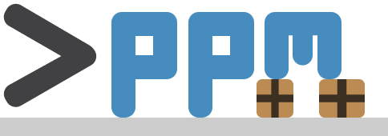

<div align="center">
    ppm">
    <br>
    <br>
    
    
    
    <br>
    <br>
    <br>
</div>

**Pour Package Manager**

Easily install and manage Godot-plugins from GitHub using the command line

## Commands

### Initialize

Initialize a `ppm.json` file

```bash
$ ppm init
```

### Install

Either declare a plugin to install or install all plugins that are declared in the `ppm.json` file

#### Install plugin from GitHub

```bash
$ ppm install <user>/<repository>
```

#### Install plugin from the Godot asset library

```bash
$ ppm install <plugin>
```

### Update

Update all your plugins

```bash
$ ppm update
```

### Uninstall

Uninstall a dependency

```bash
$ ppm uninstall <plugin>
```

### More

For further information and commands use

```bash
$ ppm -h
```

## Installation

### Main way

Download the binary from the [**release page**](https://github.com/Glow-Project/ppm/releases)

### Installation from Source

```bash
$ git clone https://github.com/Glow-Project/ppm

$ go install
```

### Migration to newer versions

To migrate your ppm project from an older to a newer version you can simply run:

```sh
$ ppm tidy
```

## Requirements

- [**Git**](https://git-scm.com/) _Only needed with [v1.0.1](https://github.com/Glow-Project/ppm/releases/tag/1.0.1) or lower_
- [**Golang**](https://golang.org/) _Only needed for installation from source_
